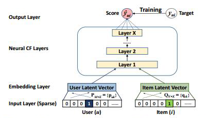

## 1、问题描述

### 1.1 数据集描述

#### 1、训练集

由$(user, item, score)$数据构成的数据集，为了便于训练，我们将训练集按照$9:1$的比例分成训练集和验证集，通过验证集的结果来反馈，判断我们算法实现的效果， 以防止在调参过程中出现的问题。

其中整体训练集规模为$(5001507,3)$,$user\_id$数量为19835条，$item\_id$数量为455705条，训练集中无重复$user,item$样例对。评分情况统计如下表。

| 评分情况统计 |       |
| ------------ | ----- |
| mean         | 49.50 |
| std          | 38.22 |
| min          | 0     |
| 25%          | 0     |
| 50%          | 50    |
| 75%          | 90    |
| max          | 100   |

#### 2、测试集

由$(user, item)$数据构成的测试集，对于每个user都有6组$item$测试。测试数据$(user,item)$数量为119010，测试集规模为$(119010,2)$，测试集user数量为19835，item数量为28292，不存在重复样例。

#### 3、item属性集

对于每个$item$都进行属性描述，包含两个属性，部分$item$属性缺省$(None)$， 同时，对于没有标注的item，将其标注为$nan$。属性集规模为507172，属性1的数量为52188，属性2的数量为19692。

此外，训练集与测试集user_id的并集数量为 19835，训练集与测试集user_id的交集数量为19385，训练集与测试集item_id的并集数量为456722，训练集与测试集item_id的交集数量为27275。训练集、测试集、属性集中item_id的并集数量为 602305，训练集、测试集、属性集中item_id的交集数量为16214。

### 1.2 神经网络

近年来，深度学习在许多方面已经取得了极大的成功，人工神经网络在计算机视觉，自然语言处理等方面有长足的进步，深度的神经网络模型 在足够的算力支持下，在许多方面，能够比传统的机器学习的算法表现出 更好的效果。因此，我们考虑使用神经网络模型来实现此次作业。 

### 1.3协同过滤

基于协同过滤（Collaborative Filtering, CF）的推荐算法：根据用户的历史行为数据计算用户或者物品的相似度(比如使用余弦相似度)，然后进行推荐。这类方法的优点为：不需要任何的用户或者内容的属性特征信息；推荐效果的惊喜度、准确度、多样性较好；随着用户行为增多，推荐效果也会提升。缺点是需要大量、准确的用户行为数据；冷启动问题（新用户/物品没有行为，也找不到类似用户）；灰羊问题（个别口味特殊的用户找不到口味类似的用户）；因为采用历史行为数据，不易修改，不够灵活；覆盖率较低（数据稀疏问题，很多物品没有行为）等。该类算法又分为两种:1.基于用户的推荐;2.基于物品的推荐。

在本文中，我们选择使用基于矩阵分解的协同过滤算法(Matrix Factorization)，关于矩阵分解，可以将其理解为对评分矩阵的背后的隐因子的把握。

假设我们已经有了一个评分矩阵$R_{m,n}$，m个用户对n个物品的评分全在这个矩阵里，这是一个高度稀疏的矩阵，我们用$r_{u,i}$表示用户u对物品i的评分。LFM认为$R_{m,n} = P_{m,F}Q_{F,n}$，即R是两个矩阵的乘积，F是隐因子的个数，$P$的每一行代表一个用户对各隐因子的关注程度，Q的每一列代表一个物品在各个隐因子上的概率分布，$r_{u,i} = \sum_{f=1}^F P_{uf}Q_{fi}$。

因此，我们将结合协同过滤的思路，采用神经网络的模型，构建基于神经网络的协同过滤算法，我们将具体的算法分析细节展示在下一节。

## 2、实验配置

| 实验配置                                          |
| ------------------------------------------------- |
| 编程语言 Python 3.9.1                             |
| 开发工具 PyCharm 2020.3( Professional Edition)    |
| 工具包 numpy, pandas, matplotlib, scipy , torch等 |
| 操作系统 Windows 10                               |

## 3、算法原理

我们的算法基本思路如下图所示，



我们的神经网络架构主要包括如下几个部分：1、输入层和embedding层，2、利用多层神经网络搭建的矩阵分解协同过滤算法，3、输出层。这里主要对第一和第二部分进行具体的算法原理介绍。

### 3.1 one-hot编码与embedding层

one-hot编码又称为独热编码、一位有效编码。其方法是使用呎位状态寄存器来对N个状态进行编码，每个状态都有它独立的寄存器位，并且在任意时候，其中只有一位有效。采用呯呮呥吭周呯呴编码能够较好地反映数据的特征，并对后续的embedding的处理有较好的结果。但是，如果只是采用呯呮呥吭周呯呴编码的话，我们可以明显发现，这样的编码结果使得数据量急剧变大，会导致我们无法对其进行处理。比如，以本次实验数据集为例，我们的user_id和item_id的数量分别达到了19835和602305个，如果采用one-hot编码的话，数据规模将会非常庞大，导致数据处理和模型训练变得非常困难。

下图表示了对于user_id进行编码时采用one-hot编码和embedding方式的区别，我们能够清楚的发现，使用one-hot编码方式，用户的嵌入矩阵是一个庞大的01稀疏矩阵，而采用embedding的方式我们能够大幅缩小数据规模从而获得一个密集的嵌入矩阵。


此外，如上图所示，在进行one-hot编码时，编码得到的向量会很高维也会很稀疏，同时，我们无法有效地判断两个不同的编码对之间的相似度，这会使得我们的协同过滤过程无法有效进行。实际上，embedding编码这一思路来源于自然语言处理中的word2vec的方法，从本质上而言，embedding是在捕捉向量中的隐因子（潜在因子），而我们实际上可以利用相似度的计算来得到两个不同向量之间的相似度。这样，我们就可以使用嵌入矩阵来而不是庞大的one-hot编码向量来，从而保持每个向量更小。

此外，基于embedding方式我们能够嵌入更多的信息，从而丰富模型对user和item的理解程度，我们可以进一步的对item的attributes（属性）信息进行嵌入，从而让我们能够学习到更多的关于item的性质，从而帮助我们的模型得到更加准确的评分，因此进一步地我们能够在原有的模型基础上添加两个对于属性1和属性2的嵌入层。

### 3.2 基于神经网络的协同过滤层

在本文的模型中，我们主要运用了多层的神经网络来进行协同过滤的处理，具体的。我们使用了两层的线性层对user_id、item_id、item_attr1、item_attr2的嵌入向量所谓模型的输入，并利用两层线性层的输出作为评分预测结果。

我们首先将item_attr1和item_attr2的嵌入层输出结果与user_id以及item_id的嵌入进行合并，形成一个新的矩阵$K$。我们首先来关注embedding层的作用，实际上，可以明显的看到，embedding层作了一个对于原矩阵R的压缩，而这样的压缩是基于embedding的，更确切的说，是基于vector的相似度的。这样一种相似度，利用的是cosine的相似度的计算方式，并将其压缩到规定的隐因子数目中。

而对于后续压缩的矩阵，其和SVD等传统机器学习算法中的矩阵分解是不同的。传统算法中，以SVD为例，将评分矩阵分解为$R_{U\times I} = P_{U\times K} Q_{K\times I}$，将矩阵分解之后，未知的频分可以用$\overline{d} = p^T_uq_i $表示，因此，我们可以用真实值与预测值之间的误差来训练，继而算出总的误差平方和。当时由于SVD作为一种传统的线性模型，其拟合结果将服从正态分布，在数据分布不符合明显正态分布的情况下可能效果并不太好，例如本文的数据集大量集中于较低的0评分。

然而，在基于神经网络的协同过滤方法中，利用多层神经网络搭建的模型，因其结构中的非线性激活层，解决了线性模型预测结果服从正态分布的问题，能够更好的学习到训练数据集中隐含的用户和商品之间的特征关联关系，并且通过多层神经网络的学习，利用反向传布，我们能够得到更多更好的结果。

## 4、算法实现

### 4.1 数据加载和处理

我们首先对数据进行预处理，并统计数据集相关的统计信息，具体的处理代码主要位于`preprocess.py`文件中，由于这部分代码与算法核心内容无关，故在此不做展示。

为了更好地对模型进行训练和测试，我们将训练集中的50万条user-item对数据按照19:1的比例划分为训练集和验证集，数据集加载代码主要位于`data.py`文件，具体代码如下所示：

```python
import torch.utils.data as data
import pandas as pd
import torch
import json

class Dataset(data.Dataset):
    def __init__(self, cfg, filename, attr, type,validate_rate = None):
        '''
        :param cfg: config options
        :param filename: the path of the dataset
        :param attr: the path of the attribute
        :param type: train, test or valid
        :param validate_rate: the rate of validation
        '''
        super(Dataset, self).__init__()
        self.frame = pd.read_csv(filename)
        self.attr = attr
        self.type = type
        
        self.attr1_id2idx = json.load(open(cfg.DATA.ATTR1_ID2IDX, 'r'))
        self.idx2attr1_id = json.load(open(cfg.DATA.IDX2ATTR1_ID, 'r'))
        self.attr2_id2idx = json.load(open(cfg.DATA.ATTR2_ID2IDX, 'r'))
        self.idx2attr2_id = json.load(open(cfg.DATA.IDX2ATTR2_ID, 'r'))
        self.user_id2idx = json.load(open(cfg.DATA.USER_ID2IDX, 'r'))
        self.idx2user_id = json.load(open(cfg.DATA.IDX2USER_ID, 'r'))
        self.item_id2idx = json.load(open(cfg.DATA.ITEM_ID2IDX, 'r'))
        self.idx2item_id = json.load(open(cfg.DATA.IDX2ITEM_ID, 'r'))
        
        if validate_rate is not None:
            if type == 'train':
                self.frame = self.frame.iloc[:int(len(self.frame) * (1 - validate_rate))]
                print('train set size:', len(self.frame))
            elif type == 'valid':
                self.frame = self.frame.iloc[int(len(self.frame) * (1 - validate_rate)):]
                print('valid set size:', len(self.frame))
    def __len__(self):
        return len(self.frame)
    
    def __getitem__(self, index):
        if self.type == 'train' or self.type == 'valid':
            user, item, target = self.frame.iloc[index, 0], self.frame.iloc[index, 1], self.frame.iloc[index, 2]
        elif self.type == 'test':
            user, item  = self.frame.iloc[index, 0], self.frame.iloc[index, 1]
        user_idx = int(self.user_id2idx[str(user)])
        item_idx = int(self.item_id2idx[str(item)])
        try:
            attr1, attr2 = self.attr[item][0], self.attr[item][1]
            attr1_idx =  int(self.attr1_id2idx[str(attr1)])
            attr2_idx =  int(self.attr2_id2idx[str(attr2)])
        except KeyError:
            attr1_idx, attr2_idx = -1, -1  # -1 means no attribute
        attr1_idx, attr2_idx = torch.FloatTensor([attr1_idx]), torch.FloatTensor([attr2_idx])
        if self.type == 'train' or self.type == 'valid':
            return user_idx, item_idx, target, attr1_idx, attr2_idx
        elif self.type == 'test':
            return user_idx, item_idx, attr1_idx, attr2_idx


```

我们采用深度学习模块`pytorch`作为搭建深度学习网络的基本框架，基于神经网络的协同过滤算法模型代码主要位于`RS.py`文件，具体代码如下所示：

```python
import torch.nn as nn
import torch 

class RS(nn.Module):
    def __init__(self, cfg, embedding_dim, para1, para2, attr):
        '''
        @param cfg: config options
        @param embedding_dim: the dimension of embedding
        @param para1: the parameter of the first layer
        @param para2: the parameter of the second layer
        @param attr: the attribute of the item
        '''
        super(RS, self).__init__()
        self.cfg = cfg
        self.embedding_dim = embedding_dim
        self.para1 = para1
        self.para2 = para2
        self.attr = attr
        
        self.default1 = nn.Parameter(torch.FloatTensor([0]), requires_grad=True)
        self.default2 = nn.Parameter(torch.FloatTensor([0]), requires_grad=True)
        self.default3 = nn.Parameter(torch.FloatTensor([0]), requires_grad=True)
        self.default4 = nn.Parameter(torch.FloatTensor([0]), requires_grad=True)
        
        self.embedding_user = nn.Embedding(self.cfg.MODEL.USER_NUM, self.embedding_dim)
        self.embedding_item = nn.Embedding(self.cfg.MODEL.ITEM_NUM, self.embedding_dim)
        self.embedding_attr1 = nn.Embedding(self.cfg.MODEL.ATTR1_NUM, self.embedding_dim)
        self.embedding_attr2 = nn.Embedding(self.cfg.MODEL.ATTR2_NUM, self.embedding_dim)

        
        self.CF_layer1 = nn.Linear(self.embedding_dim*4, self.para1)
        self.BN_layer1 = nn.BatchNorm1d(self.para1)
        self.act_layer1  = nn.ReLU()
        self.Dropout_layer1 = nn.Dropout(self.cfg.MODEL.DROPOUT_RATE1)
        
        self.CF_layer2 = nn.Linear(self.para1, self.para2)
        self.BN_layer2 = nn.BatchNorm1d(self.para2)
        self.act_layer2  = nn.ReLU()
        self.Dropout_layer2 = nn.Dropout(self.cfg.MODEL.DROPOUT_RATE2)
        
        self.CF_layer3 = nn.Linear(self.para2, 1)
    
    def forward(self, device, user_id, item_id, attr1_id, attr2_id):
        # handle the special token -1 in the input
        for i in range(attr1_id.size()[0]):
            # if attr1_id[i] == 0:        # None 
                # attr1_id[i] = self.default1
            if attr1_id[i] == -1:       # Not exist attr1
                attr1_id[i] = self.default3
            # if attr2_id[i] == 0:        # None
            #     attr2_id[i] = self.default2
            if attr2_id[i] == -1:       # Not exist attr2
                attr2_id[i] = self.default4

        attr1 = self.embedding_attr1(attr1_id.long())
        attr2 = self.embedding_attr2(attr2_id.long())
        user = self.embedding_user(user_id)
        item = self.embedding_item(item_id)

        attr1.squeeze_()
        attr2.squeeze_()
        user.squeeze_()
        item.squeeze_()

        x = torch.cat((user, item, attr1, attr2), 1)
        x = x.to(device)

        x = self.CF_layer1(x)
        x = self.BN_layer1(x)
        x = self.act_layer1(x)
        x = self.Dropout_layer1(x)

        x = self.CF_layer2(x)
        x = self.BN_layer2(x)
        x = self.act_layer2(x)
        x = self.Dropout_layer2(x)

        x = self.CF_layer3(x)

        return x

    def save_model(self, path):
        torch.save(self.state_dict(), path)
    
    def load_model(self, path):
        self.load_state_dict(torch.load(path))
```

## 5、实验结果及分析

## 6、实验小结

## 参考资料

[1] 万物皆可嵌入——embedding在GPU中的实现.https://www.birentech.com/news/164.html


